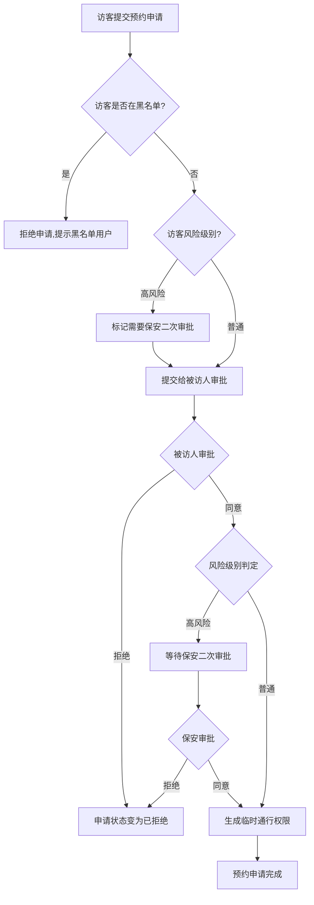
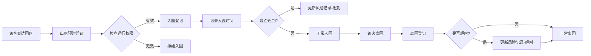
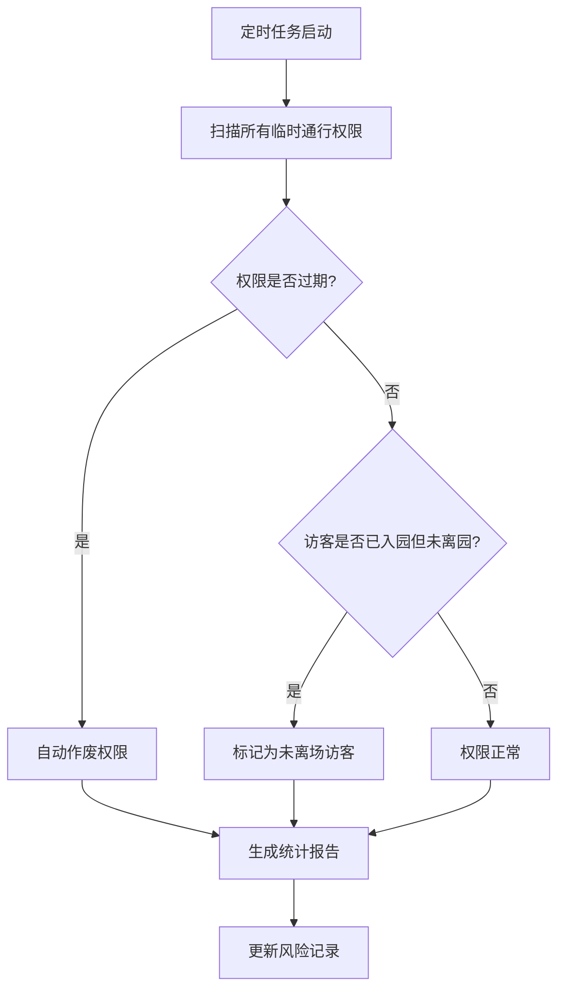

# 门禁访客预约系统产品需求文档

## 1. 产品概述

门禁访客预约系统是一套用于管理园区访客进出权限的智能化管理系统，通过数字化流程实现访客预约、审批、通行权限管理的全流程管控。

- 实现访客在线预约、被访人审批、临时通行权限生成的完整流程
- 通过风险记录和黑名单机制提升园区安全性
- 支持多区域权限分级管理和智能超时处理
- 目标用户：园区访客、被访员工、保安管理人员

## 2. 核心功能

### 2.1 用户角色

| 角色 | 说明 | 核心权限 |
|------|------|----------|
| 访客 | 提交访问申请的人员 | 提交预约申请、查看申请状态、办理入园离园登记 |
| 被访人 | 接待访客的企业员工 | 审批访客申请、取消已确认的预约 |
| 保安 | 园区安全管理人员 | 二次审批高风险访客、查看风险记录、黑名单管理 |
| 管理员 | 系统运维人员 | 区域配置、权限级别管理、定时任务监控 |

### 2.2 功能模块

1. **访客端**：预约申请、申请状态查询、入园登记、离园登记
2. **被访人端**：预约审批、预约管理
3. **保安端**：高风险访客审批、风险记录查看、黑名单管理
4. **管理端**：区域配置、权限级别管理、数据统计
5. **通行权限管理**：权限生成、权限作废、权限查询

## 3. 核心业务流程

### 3.1 访客预约申请流程



### 3.2 入园离园流程



### 3.3 定时任务流程



## 4. 用户界面设计

### 4.1 设计风格

- **主题色调**：深蓝色 #1a365d 为主色调，配合浅蓝色 #3182ce 作为辅助色
- **按钮样式**：圆角按钮，悬停时有阴影效果
- **字体选择**：
  - 标题：思源黑体 Bold
  - 正文：思源黑体 Regular
  - 数据展示：Roboto Mono
- **布局风格**：卡片式布局，左侧导航栏，右侧主内容区
- **图标风格**：线性图标，配套使用 Font Awesome 图标库
- **交互反馈**：
  - 按钮悬停：背景色加深，轻微上移
  - 表单验证：红色边框配合错误提示文字
  - 加载状态：旋转的加载图标配合灰色遮罩

### 4.2 页面设计

#### 访客端页面

| 页面名称 | 模块名称 | UI元素 |
|---------|---------|--------|
| 首页 | 导航栏、欢迎区 | Logo、用户头像、快捷入口按钮 |
| 预约申请页 | 预约表单 | 被访人选择器、时间选择器、区域选择器、提交按钮 |
| 申请记录页 | 申请列表 | 状态标签、时间轴、详情展开按钮 |

#### 被访人端页面

| 页面名称 | 模块名称 | UI元素 |
|---------|---------|--------|
| 待审批页 | 审批列表 | 申请人信息卡片、审批按钮、批量审批工具栏 |
| 已处理页 | 历史记录 | 筛选器、统计图表 |

#### 保安端页面

| 页面名称 | 模块名称 | UI元素 |
|---------|---------|--------|
| 二次审批页 | 审批队列 | 高风险标记、申请人详情、审批工具栏 |
| 风险记录页 | 风险列表 | 风险等级标签、时间线、详情查看 |
| 黑名单页 | 黑名单管理 | 添加/移除按钮、搜索工具栏 |

#### 管理端页面

| 页面名称 | 模块名称 | UI元素 |
|---------|---------|--------|
| 区域管理页 | 区域配置 | 区域列表、权限级别编辑器 |
| 数据统计页 | 统计面板 | 实时访客数、待处理审批数、风险统计图表 |
| 定时任务监控页 | 任务列表 | 任务状态、执行日志 |

## 5. 功能详细说明

### 5.1 访客申请（功能1）

访客在提交预约时需要绑定：
- **访问对象**：被访人的工号或姓名
- **访问时间段**：入园时间和预计离园时间
- **访问区域**：需要进入的园区区域
- **访问事由**：简要说明访问目的

### 5.2 临时通行权限生成（功能2）

被访人确认预约后，系统生成临时通行权限，包括：
- 唯一权限码
- 权限有效时间段
- 可访问区域列表
- 权限状态（待激活/已激活/已过期/已作废）

### 5.3 风险记录更新（功能3）

系统自动检测并记录以下风险：
- **迟到**：访客入园时间晚于预约时间超过30分钟
- **超时离场**：访客离园时间晚于预计离园时间
- **未离场**：预约时间段结束后仍未离园
- **爽约**：预约时间段开始后2小时内未入园

### 5.4 黑名单管理（功能4）

- 保安可将违反规定的访客加入黑名单
- 黑名单访客的申请直接被系统拒绝
- 黑名单支持设置有效期，过期后自动移出

### 5.5 区域权限分级（功能5）

- **一级区域**：普通办公区，基础权限即可访问
- **二级区域**：研发/机密区域，需要中级权限
- **三级区域**：核心机密区域，需要高级权限
- 访客根据预约区域自动获得相应级别的临时权限

### 5.6 预约取消与权限作废（功能6）

- 被访人取消预约时，系统自动作废对应通行权限
- 作废的权限立即失效，访客无法再使用
- 系统发送通知给访客和保安

### 5.7 定时任务（功能7）

- 每5分钟执行一次权限过期检查
- 每小时统计一次未离场访客
- 每日凌晨生成风险统计报告

### 5.8 高风险访客二次审批（功能8）

- 系统根据访客历史记录自动判定风险等级
- 高风险访客需要保安进行二次审批
- 保安可查看访客的历史风险记录后做出决定

## 6. 数据模型

### 6.1 访客数据

```
Visitor {
    id: string (UUID)
    name: string
    phone: string
    idCard: string
    email: string
    riskLevel: enum (LOW, MEDIUM, HIGH)
    blacklistUntil: datetime | null
    createdAt: datetime
    updatedAt: datetime
}
```

### 6.2 预约申请数据

```
VisitRequest {
    id: string (UUID)
    visitorId: string
    hostId: string
    areaId: string
    expectedEntryTime: datetime
    expectedExitTime: datetime
    reason: string
    status: enum (PENDING, APPROVED, REJECTED, CANCELLED, EXPIRED)
    requireSecurityApproval: boolean
    securityApprovalStatus: enum (PENDING, APPROVED, REJECTED) | null
    createdAt: datetime
    updatedAt: datetime
}
```

### 6.3 通行权限数据

```
AccessPermission {
    id: string (UUID)
    requestId: string
    visitorId: string
    permissionCode: string
    validFrom: datetime
    validUntil: datetime
    accessibleAreas: string[]
    permissionLevel: enum (BASIC, INTERMEDIATE, ADVANCED)
    status: enum (PENDING, ACTIVE, EXPIRED, REVOKED)
    createdAt: datetime
    updatedAt: datetime
}
```

### 6.4 区域数据

```
Area {
    id: string (UUID)
    name: string
    description: string
    requiredPermissionLevel: enum (BASIC, INTERMEDIATE, ADVANCED)
    status: enum (ACTIVE, INACTIVE)
    createdAt: datetime
}
```

### 6.5 风险记录数据

```
RiskRecord {
    id: string (UUID)
    visitorId: string
    requestId: string
    riskType: enum (LATE, OVERSTAY, NOT_EXITED, NO_SHOW)
    severity: enum (LOW, MEDIUM, HIGH)
    description: string
    recordedAt: datetime
}
```

## 7. 系统配置

### 7.1 风险判定规则

- **迟到阈值**：入园时间晚于预约时间30分钟以上
- **超时阈值**：离园时间晚于预计离园时间15分钟以上
- **未离场判定**：预约结束后2小时仍未离园
- **高风险访客标准**：30天内风险记录超过3条

### 7.2 定时任务配置

- 权限过期检查：每5分钟执行
- 未离场统计：每小时执行
- 风险统计报告：每日凌晨2点执行
- 日志清理：每周执行一次

## 8. 响应式设计

- **桌面优先**：主要针对桌面端用户设计
- **平板适配**：支持 iPad 和 Android 平板
- **手机适配**：提供简化版功能，核心审批功能可用
- **触摸优化**：按钮最小点击区域 44x44 像素

## 9. 性能指标

- 页面加载时间：不超过 2 秒
- API 响应时间：不超过 500 毫秒
- 并发支持：至少支持 100 个同时在线用户
- 数据存储：全部保存在本地内存，使用 Java Map/Set/List
