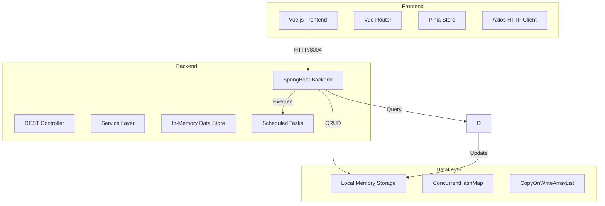

# 门禁访客预约系统技术架构文档

## 1. 系统架构设计

### 1.1 整体架构图



### 1.2 技术栈

- **前端框架**：Vue 3 + Composition API
- **路由管理**：Vue Router 4
- **状态管理**：Pinia
- **HTTP 客户端**：Axios
- **UI 组件**：自定义组件 + CSS3
- **后端框架**：SpringBoot 2.7.x
- **Java 版本**：Java 8
- **数据存储**：本地内存（ConcurrentHashMap）
- **定时任务**：Spring @Scheduled
- **构建工具**：Maven (后端) + Vite (前端)

## 2. 项目结构

### 2.1 后端项目结构

```
backend/
├── src/main/java/com/visitor/access/
│   ├── VisitorAccessApplication.java
│   ├── controller/
│   │   ├── VisitorController.java
│   │   ├── VisitRequestController.java
│   │   ├── PermissionController.java
│   │   ├── AreaController.java
│   │   ├── RiskRecordController.java
│   │   └── SecurityController.java
│   ├── service/
│   │   ├── VisitorService.java
│   │   ├── VisitRequestService.java
│   │   ├── PermissionService.java
│   │   ├── AreaService.java
│   │   ├── RiskRecordService.java
│   │   ├── BlacklistService.java
│   │   └── ScheduledTaskService.java
│   ├── repository/
│   │   ├── InMemoryRepository.java
│   │   ├── VisitorRepository.java
│   │   ├── VisitRequestRepository.java
│   │   ├── PermissionRepository.java
│   │   ├── AreaRepository.java
│   │   └── RiskRecordRepository.java
│   ├── model/
│   │   ├── Visitor.java
│   │   ├── VisitRequest.java
│   │   ├── AccessPermission.java
│   │   ├── Area.java
│   │   ├── RiskRecord.java
│   │   └── enums/
│   │       ├── RiskLevel.java
│   │       ├── PermissionLevel.java
│   │       ├── RequestStatus.java
│   │       ├── PermissionStatus.java
│   │       └── RiskType.java
│   ├── dto/
│   │   ├── request/
│   │   │   ├── VisitRequestDTO.java
│   │   │   └── BlacklistDTO.java
│   │   └── response/
│   │       ├── ApiResponse.java
│   │       ├── VisitRequestResponse.java
│   │       └── PermissionResponse.java
│   └── config/
│       └── WebConfig.java
├── src/main/resources/
│   └── application.yml
└── pom.xml
```

### 2.2 前端项目结构

```
frontend/
├── src/
│   ├── main.js
│   ├── App.vue
│   ├── router/
│   │   └── index.js
│   ├── stores/
│   │   ├── visitor.js
│   │   ├── visitRequest.js
│   │   ├── permission.js
│   │   └── auth.js
│   ├── views/
│   │   ├── visitor/
│   │   │   ├── VisitorHome.vue
│   │   │   ├── VisitRequest.vue
│   │   │   └── RequestList.vue
│   │   ├── host/
│   │   │   ├── HostHome.vue
│   │   │   ├── PendingApproval.vue
│   │   │   └── ApprovedList.vue
│   │   ├── security/
│   │   │   ├── SecurityHome.vue
│   │   │   ├── SecurityApproval.vue
│   │   │   ├── RiskRecords.vue
│   │   │   └── Blacklist.vue
│   │   ├── admin/
│   │   │   ├── AdminHome.vue
│   │   │   ├── AreaManagement.vue
│   │   │   └── Statistics.vue
│   │   └── common/
│   │       ├── Login.vue
│   │       └── NotFound.vue
│   ├── components/
│   │   ├── common/
│   │   │   ├── NavBar.vue
│   │   │   ├── SideBar.vue
│   │   │   ├── StatusTag.vue
│   │   │   └── Loading.vue
│   │   └── forms/
│   │       ├── VisitRequestForm.vue
│   │       └── ApprovalForm.vue
│   ├── services/
│   │   └── api.js
│   ├── utils/
│   │   ├── date.js
│   │   └── validate.js
│   └── assets/
│       └── styles/
│           ├── variables.css
│           └── main.css
├── public/
│   └── index.html
├── package.json
├── vite.config.js
└── .env
```

## 3. API 接口定义

### 3.1 访客管理接口

#### 创建访客
```
POST /api/visitors
Request:
{
    "name": "张三",
    "phone": "13800138000",
    "idCard": "110101199001011234",
    "email": "zhangsan@example.com"
}
Response:
{
    "code": 200,
    "message": "success",
    "data": {
        "id": "uuid",
        "name": "张三",
        "phone": "13800138000",
        "idCard": "110101199001011234",
        "email": "zhangsan@example.com",
        "riskLevel": "LOW",
        "blacklistUntil": null,
        "createdAt": "2024-01-01T10:00:00"
    }
}
```

#### 查询访客
```
GET /api/visitors/{id}
Response:
{
    "code": 200,
    "data": { ... }
}
```

### 3.2 预约申请接口

#### 提交预约申请
```
POST /api/visit-requests
Request:
{
    "visitorId": "uuid",
    "hostId": "uuid",
    "areaId": "uuid",
    "expectedEntryTime": "2024-01-01T09:00:00",
    "expectedExitTime": "2024-01-01T18:00:00",
    "reason": "商务洽谈"
}
Response:
{
    "code": 200,
    "message": "申请已提交",
    "data": {
        "id": "uuid",
        "visitorId": "uuid",
        "hostId": "uuid",
        "areaId": "uuid",
        "expectedEntryTime": "2024-01-01T09:00:00",
        "expectedExitTime": "2024-01-01T18:00:00",
        "reason": "商务洽谈",
        "status": "PENDING",
        "requireSecurityApproval": false,
        "createdAt": "2024-01-01T08:00:00"
    }
}
```

#### 被访人审批
```
POST /api/visit-requests/{id}/approve
Request:
{
    "approved": true,
    "comment": "同意访问"
}
Response:
{
    "code": 200,
    "message": "审批成功",
    "data": { ... }
}
```

#### 保安二次审批
```
POST /api/visit-requests/{id}/security-approve
Request:
{
    "approved": true,
    "comment": "审核通过"
}
Response:
{
    "code": 200,
    "message": "审批成功",
    "data": { ... }
}
```

#### 取消预约
```
POST /api/visit-requests/{id}/cancel
Response:
{
    "code": 200,
    "message": "预约已取消",
    "data": null
}
```

#### 查询预约列表
```
GET /api/visit-requests
Query Parameters:
- visitorId: string (optional)
- hostId: string (optional)
- status: string (optional)
- page: int (default: 1)
- size: int (default: 10)

Response:
{
    "code": 200,
    "data": {
        "list": [ ... ],
        "total": 100,
        "page": 1,
        "size": 10
    }
}
```

### 3.3 通行权限接口

#### 入园登记
```
POST /api/permissions/{id}/check-in
Response:
{
    "code": 200,
    "message": "入园成功",
    "data": {
        "permissionId": "uuid",
        "actualEntryTime": "2024-01-01T09:15:00",
        "status": "ACTIVE",
        "isLate": true
    }
}
```

#### 离园登记
```
POST /api/permissions/{id}/check-out
Response:
{
    "code": 200,
    "message": "离园成功",
    "data": {
        "permissionId": "uuid",
        "actualExitTime": "2024-01-01T18:30:00",
        "status": "EXPIRED",
        "isOverstay": true
    }
}
```

#### 查询权限
```
GET /api/permissions/{id}
Response:
{
    "code": 200,
    "data": { ... }
}
```

### 3.4 区域管理接口

#### 创建区域
```
POST /api/areas
Request:
{
    "name": "研发部",
    "description": "研发中心",
    "requiredPermissionLevel": "INTERMEDIATE"
}
Response:
{
    "code": 200,
    "data": { ... }
}
```

#### 查询区域列表
```
GET /api/areas
Response:
{
    "code": 200,
    "data": [
        {
            "id": "uuid",
            "name": "研发部",
            "description": "研发中心",
            "requiredPermissionLevel": "INTERMEDIATE",
            "status": "ACTIVE"
        }
    ]
}
```

### 3.5 风险记录接口

#### 查询风险记录
```
GET /api/risk-records
Query Parameters:
- visitorId: string (optional)
- riskType: string (optional)
- severity: string (optional)
- startDate: string (optional)
- endDate: string (optional)

Response:
{
    "code": 200,
    "data": {
        "list": [ ... ],
        "total": 50
    }
}
```

### 3.6 黑名单接口

#### 添加黑名单
```
POST /api/blacklist
Request:
{
    "visitorId": "uuid",
    "reason": "违反园区规定",
    "expireAt": "2025-01-01T00:00:00"
}
Response:
{
    "code": 200,
    "message": "已添加到黑名单"
}
```

#### 移除黑名单
```
DELETE /api/blacklist/{visitorId}
Response:
{
    "code": 200,
    "message": "已从黑名单移除"
}
```

#### 查询黑名单
```
GET /api/blacklist
Response:
{
    "code": 200,
    "data": [ ... ]
}
```

### 3.7 统计数据接口

#### 获取统计数据
```
GET /api/statistics
Response:
{
    "code": 200,
    "data": {
        "todayVisitors": 50,
        "pendingApprovals": 10,
        "activePermissions": 25,
        "riskRecords": 5,
        "notExitedVisitors": 3
    }
}
```

## 4. 数据模型

### 4.1 枚举定义

```java
// 风险等级
public enum RiskLevel {
    LOW,      // 低风险
    MEDIUM,   // 中风险
    HIGH      // 高风险
}

// 权限级别
public enum PermissionLevel {
    BASIC,        // 基础权限（一级区域）
    INTERMEDIATE, // 中级权限（二级区域）
    ADVANCED      // 高级权限（三级区域）
}

// 预约状态
public enum RequestStatus {
    PENDING,    // 待审批
    APPROVED,   // 已批准
    REJECTED,   // 已拒绝
    CANCELLED,  // 已取消
    EXPIRED     // 已过期
}

// 权限状态
public enum PermissionStatus {
    PENDING,    // 待激活
    ACTIVE,     // 已激活
    EXPIRED,    // 已过期
    REVOKED     // 已作废
}

// 风险记录类型
public enum RiskType {
    LATE,       // 迟到
    OVERSTAY,   // 超时离场
    NOT_EXITED, // 未离场
    NO_SHOW     // 爽约
}

// 审批状态
public enum ApprovalStatus {
    PENDING,
    APPROVED,
    REJECTED
}
```

### 4.2 实体类定义

```java
// 访客
public class Visitor {
    private String id;
    private String name;
    private String phone;
    private String idCard;
    private String email;
    private RiskLevel riskLevel;
    private LocalDateTime blacklistUntil;
    private LocalDateTime createdAt;
    private LocalDateTime updatedAt;
}

// 预约申请
public class VisitRequest {
    private String id;
    private String visitorId;
    private String hostId;
    private String areaId;
    private LocalDateTime expectedEntryTime;
    private LocalDateTime expectedExitTime;
    private String reason;
    private RequestStatus status;
    private boolean requireSecurityApproval;
    private ApprovalStatus securityApprovalStatus;
    private String hostComment;
    private String securityComment;
    private LocalDateTime createdAt;
    private LocalDateTime updatedAt;
}

// 通行权限
public class AccessPermission {
    private String id;
    private String requestId;
    private String visitorId;
    private String permissionCode;
    private LocalDateTime validFrom;
    private LocalDateTime validUntil;
    private List<String> accessibleAreas;
    private PermissionLevel permissionLevel;
    private PermissionStatus status;
    private LocalDateTime actualEntryTime;
    private LocalDateTime actualExitTime;
    private LocalDateTime createdAt;
    private LocalDateTime updatedAt;
}

// 区域
public class Area {
    private String id;
    private String name;
    private String description;
    private PermissionLevel requiredPermissionLevel;
    private String status;
    private LocalDateTime createdAt;
}

// 风险记录
public class RiskRecord {
    private String id;
    private String visitorId;
    private String requestId;
    private RiskType riskType;
    private String severity;
    private String description;
    private LocalDateTime recordedAt;
}

// 黑名单
public class BlacklistEntry {
    private String id;
    private String visitorId;
    private String reason;
    private LocalDateTime expireAt;
    private LocalDateTime createdAt;
}
```

## 5. 定时任务设计

### 5.1 任务配置

```java
@Scheduled(fixedRate = 300000) // 每5分钟
public void checkExpiredPermissions() { }

@Scheduled(fixedRate = 3600000) // 每小时
public void checkNotExitedVisitors() { }

@Scheduled(cron = "0 0 2 * * ?") // 每天凌晨2点
public void generateDailyRiskReport() { }
```

### 5.2 任务详情

1. **权限过期检查**（每5分钟）
   - 扫描所有 PENDING 和 ACTIVE 状态的权限
   - 将超过 validUntil 的权限标记为 EXPIRED
   - 更新权限状态

2. **未离场访客检查**（每小时）
   - 查询所有 ACTIVE 状态的权限
   - 检查权限是否超过 validUntil 2小时以上
   - 生成 NOT_EXITED 风险记录
   - 更新统计数据

3. **每日风险报告**（每天凌晨2点）
   - 统计过去24小时的风险记录
   - 更新访客风险等级
   - 清理过期黑名单
   - 生成统计报表

## 6. 核心业务逻辑

### 6.1 预约申请流程

```
1. 验证访客是否在黑名单
   └─ 在黑名单 → 拒绝申请，返回错误

2. 检查访客风险等级
   └─ HIGH 风险 → 标记 requireSecurityApproval = true

3. 创建预约申请记录
   └─ 状态设为 PENDING

4. 返回申请结果
```

### 6.2 审批流程

```
1. 被访人审批
   ├─ 同意:
   │  ├─ 检查是否需要保安审批
   │  │  ├─ 是 → 状态设为 APPROVED, securityApprovalStatus = PENDING
   │  │  └─ 否 → 生成通行权限
   │  └─ 发送通知
   └─ 拒绝:
      └─ 状态设为 REJECTED

2. 保安审批（仅高风险访客）
   ├─ 同意 → 生成通行权限
   └─ 拒绝 → 状态设为 REJECTED
```

### 6.3 权限生成逻辑

```
1. 检查预约状态是否为 APPROVED
2. 验证区域信息
3. 根据区域确定权限级别
4. 生成唯一权限码
5. 创建 AccessPermission 记录
6. 设置 validFrom = expectedEntryTime
7. 设置 validUntil = expectedExitTime
8. 设置 status = PENDING
9. 返回权限信息
```

### 6.4 入园流程

```
1. 验证权限码
2. 检查权限状态
   └─ 不是 PENDING → 拒绝入园

3. 检查时间
   ├─ 未到 validFrom → 拒绝入园
   └─ 超过 validFrom 2小时 → 拒绝入园

4. 入园登记
   ├─ 记录 actualEntryTime
   ├─ 设置 status = ACTIVE
   ├─ 检查是否迟到
   │  ├─ 是 → 创建 LATE 风险记录
   │  └─ 否 → 正常入园
   └─ 返回入园结果
```

### 6.5 离园流程

```
1. 验证权限码
2. 检查权限状态
   └─ 不是 ACTIVE → 拒绝离园

3. 离园登记
   ├─ 记录 actualExitTime
   ├─ 设置 status = EXPIRED
   ├─ 检查是否超时
   │  ├─ 是 → 创建 OVERSTAY 风险记录
   │  └─ 否 → 正常离园
   └─ 返回离园结果
```

### 6.6 黑名单检查

```
1. 查询访客的黑名单记录
2. 检查 blacklistUntil
   ├─ 为 null → 永久黑名单
   └─ 未过期 → 临时黑名单
3. 任一情况都返回 true
```

### 6.7 风险等级计算

```
1. 统计过去30天的风险记录
2. 计算风险分：
   ├─ LATE: 1分
   ├─ OVERSTAY: 2分
   ├─ NOT_EXITED: 3分
   └─ NO_SHOW: 5分
3. 总分 >= 10 → HIGH
4. 总分 >= 5 → MEDIUM
5. 总分 < 5 → LOW
```

## 7. 配置说明

### 7.1 后端配置 (application.yml)

```yaml
server:
  port: 8004

spring:
  application:
    name: visitor-access-system
  
  jackson:
    date-format: yyyy-MM-dd HH:mm:ss
    time-zone: GMT+8

logging:
  level:
    root: INFO
    com.visitor.access: DEBUG
```

### 7.2 前端配置 (.env)

```env
VITE_API_BASE_URL=http://localhost:8004/api
VITE_APP_TITLE=门禁访客预约系统
```

## 8. 端口配置

- **后端端口**：8004
- **前端端口**：3004
- **API 前缀**：/api

## 9. 初始数据

### 9.1 初始访客

- 访客1：张三（低风险）
- 访客2：李四（中风险）
- 访客3：王五（高风险）

### 9.2 初始被访人

- 被访人1：赵经理
- 被访人2：钱主管
- 被访人3：孙工程师

### 9.3 初始区域

- 一号门（一级区域，基础权限）
- 办公区A（一级区域，基础权限）
- 研发中心（二级区域，中级权限）
- 数据中心（三级区域，高级权限）

### 9.4 初始保安

- 保安1：周保安
- 保安2：吴保安
